

<a href="https://herakles.dev">
<picture>
  <source media="(prefers-color-scheme: light)" srcset="assets/masthead-light.svg" />
  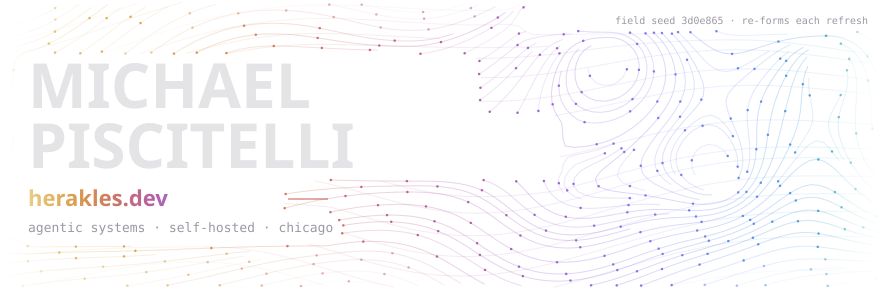
</picture>
</a>

**Solo builder shipping production AI systems.** I run an agentic development practice at
[**herakles.dev**](https://herakles.dev) and I'm launching [**keymakers.ai**](https://keymakers.ai).

<a href="https://herakles.dev">
  <picture>
    <source media="(prefers-color-scheme: light)" srcset="assets/header-light.svg" />
    
  </picture>
</a>

 

<!--START_SECTION:contribs-->
1,813 contributions in the last year
<!--END_SECTION:contribs-->

<picture>
  <source media="(prefers-color-scheme: dark)" srcset="https://raw.githubusercontent.com/herakles-dev/herakles-dev/output/pacman-contribution-graph-dark.svg" />
  <source media="(prefers-color-scheme: light)" srcset="https://raw.githubusercontent.com/herakles-dev/herakles-dev/output/pacman-contribution-graph.svg" />
  
</picture>

I'm Michael — Herakles. Fiber-optic network designer by day, and since mid-2025 a self-taught AI-agentic
engineer by night — building my own orchestration engine one 3am session at a time. The
engineering mindset stuck. The credential didn't.

The origin story is dumb and true: I automated my telecom crew's grunt work so well that we
out-earned the managers. So the company cut our per-foot rate and kept the difference. That's
the whole reason I do this now — I'd rather build the leverage and own it.

So I do. Everything here is self-hosted, runs in production, and the claims check out. I lead the
agents, review the diffs, and steer the system — more conductor than typist, though I still write
plenty of code by hand. I don't ship demos.

<picture>
  <source media="(prefers-color-scheme: light)" srcset="assets/section-01-light.svg" />
  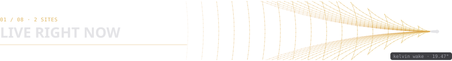
</picture>

- **[fine-print.org](https://fine-print.org)** — paste a Terms of Service, get back what you're
  actually agreeing to. Runs on my own multi-provider LLM gateway, not a single rented API.
- **[subfold.pro](https://subfold.pro)** — a music-reactive visual instrument: real-time 3D
  fractals that fold to the beat.
- **[nightjar](https://github.com/herakles-dev/nightjar)** — an offline Android app that hides data in
  sound and images, and ships the detectors that catch it. Open source, MIT.

<picture>
  <source media="(prefers-color-scheme: light)" srcset="assets/section-02-light.svg" />
  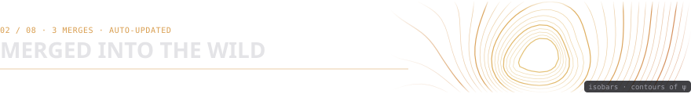
</picture>

<i>Auto-updated weekly by a GitHub Action I own — external PRs that maintainers merged, newest first. No hand-editing.</i>

<!--START_SECTION:merges-->
- **[google-deepmind/formal-conjectures#5481](https://github.com/google-deepmind/formal-conjectures/pull/5481)** &nbsp;`⭐ 1.3k` — feat(ErdosProblems/672): link an external Lean proof of erdos_672.variants.euler · `2026-09-18`
- **[google-deepmind/formal-conjectures#5425](https://github.com/google-deepmind/formal-conjectures/pull/5425)** &nbsp;`⭐ 1.3k` — feat(ErdosProblems/399): prove erdos_399.variants.cambie · `2026-09-18`
- **[affaan-m/ECC#1036](https://github.com/affaan-m/ECC/pull/1036)** &nbsp;`⭐ 265k` — feat(agents,skills): add opensource-pipeline — 3-agent workflow for safe public releases · `2026-03-31`
<!--END_SECTION:merges-->

Two of those are original Lean 4 proofs closing Erdős problems in Google DeepMind's
`formal-conjectures` — one of them fills a real gap in Mathlib. The third put a Claude Code
workflow of mine into a 265k-star repository.

<picture>
  <source media="(prefers-color-scheme: light)" srcset="assets/section-03-light.svg" />
  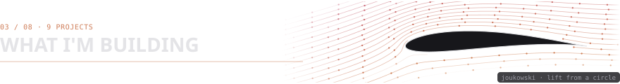
</picture>

Bare-metal infrastructure, agent orchestration, whitehat security research, formal math, GPU
visuals, a production SaaS with a real customer. Not a one-trick stack. Each card below sits on its own
clock — the description swaps in on a loop, staggered per card, no two flipping in sync.

<picture>
  <source media="(prefers-color-scheme: light)" srcset="assets/project-cards-light.svg" />
  
</picture>

[v11](https://github.com/herakles-dev/v11),
[typesafe-claude-kit](https://github.com/herakles-dev/typesafe-claude-kit) and
[nightjar](https://github.com/herakles-dev/nightjar) are public,
[subfold.pro](https://subfold.pro) is live, and `math-proof` lives at
[erdos672-four-squares-lean](https://github.com/herakles-dev/erdos672-four-squares-lean). The
rest are private or local — ask if you want a look.

<b>How v11 actually enforces itself</b> — task-as-truth, write-gate hooks, adversarial review pairing, autonomy

A raw write from an agent doesn't just land — it has to clear a gate first, and every gate outcome feeds back into how much autonomy that agent earns next time.

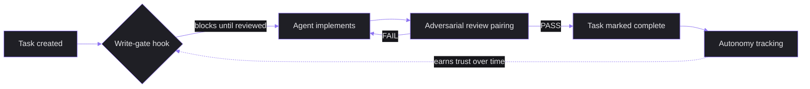

Four moving parts, each worth its own look:

Task-as-truth

Tasks are the single source of truth for what's actually done — not a status the agent reports about itself. If it's not marked complete in the task system, it didn't happen, no matter what the agent's own summary claims.

Write-gate hooks

The mechanism that makes task-as-truth real, not just a stated policy: a hook intercepts every write before it lands and blocks anything that hasn't gone through review. An agent can't just skip the gate by not mentioning it.

Adversarial review pairing

Every non-trivial task gets paired with an independent review pass before it's allowed to complete — a second look built into the pipeline itself, not something that has to be remembered or requested.

Autonomy tracking

Earned, not granted up front. A project starts at the most-supervised level and only escalates to less oversight after an actual track record — the system has to watch itself work before it's trusted to work less-watched.

<b>Hekaton</b> — the vLLM upgrade that taught me to always ship a rollback plan

Hekaton is my autonomous coding harness: a customized [DeepSeek Harness](https://github.com/deepseek-ai/deepseek-harness) running my V11 hooks unmodified, driving a tiered ensemble of Qwen coder models. It's portable now — no fixed box. It rents a cloud GPU (H100 or GH200), runs a mission, and tears itself down, with every dollar logged. Latest result: a best-of-3 fan-out took a 12-task polyglot suite from 6/12 to 10/12 for about $4.

Back when it ran on a single rented GH200, I bumped vLLM by one version with no rollback path. It broke multi-model serving on the GH200 mid-session, and I had no fast way back to the last-known-good state — just a slow rebuild. Every dependency bump now ships with a tested rollback plan before it goes anywhere near rented hardware. Expensive lesson, cheap fix.

<b>math-proof</b> — 48 machine-checked Lean proofs in 8 days, two closing real Erdős problems

Formal math was new territory for me going in. `math-proof` produced 48 Lean 4 proofs with zero `sorry`s — every one machine-verified, not just "looks right." Two of them closed actual open problems in Google DeepMind's `formal-conjectures` repo: [erdos_399.variants.cambie](https://github.com/google-deepmind/formal-conjectures/pull/5425) (an elementary mod-8 argument) and [erdos_672.variants.euler](https://github.com/google-deepmind/formal-conjectures/pull/5481), which links out to a standalone proof repo, [erdos672-four-squares-lean](https://github.com/herakles-dev/erdos672-four-squares-lean). Both merged.

<picture>
  <source media="(prefers-color-scheme: light)" srcset="assets/section-04-light.svg" />
  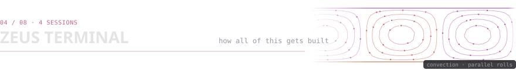
</picture>

I'm talking to Claude through it right now. Zeus Terminal is a self-hosted, mobile-first web
terminal I built to replace Termux: tmux persistence, WebSocket transport, 804 tests, continue a
session from my phone to my laptop without losing state. It's a
session multiplexer — every project gets its own window, several Claude Code agents run in
parallel, and a `/handoff` command lets me spin up a fresh session mid-task without losing
context. My daily driver, not a side project.

  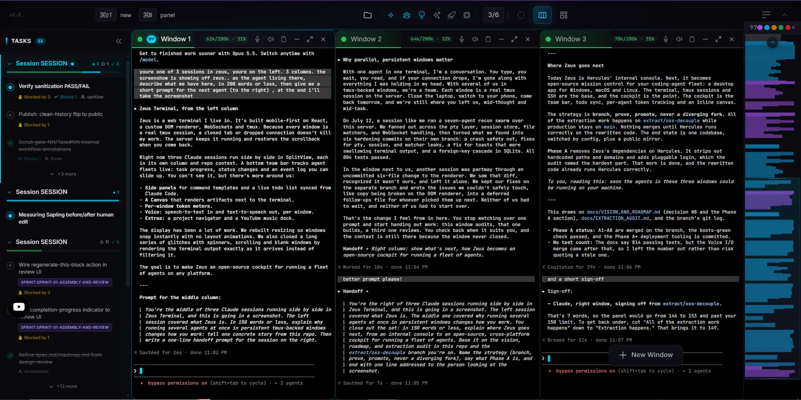

<i>This README, the Actions that keep it updated, and everything else on this page were
built from inside it.</i>

And the box underneath all of it — plus what it's actually doing right now, live,
recomputed on every fetch, straight off the same machine (no repo commit involved,
unlike everything else on this page):

  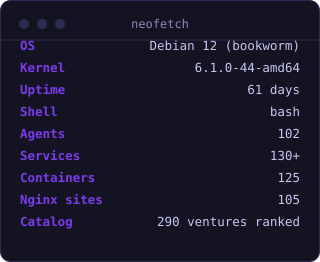
  

<picture>
  <source media="(prefers-color-scheme: light)" srcset="assets/section-05-light.svg" />
  
</picture>

- Built a **Pac-Man ghost AI** that lives on my Android homescreen and chases my taps around —
  28KB APK, runs at 2-3% CPU, entirely pointless and I love it.
- My grocery price tracker **bypasses Cloudflare** to watch 900+ items at the store down the
  street, because I got tired of guessing what's actually on sale.
- A phone-to-phone **[acoustic covert data channel](https://github.com/herakles-dev/nightjar)**, with its own on-device detector, because I
  wondered if two phones could talk without a network.
- My login page has **custom GLSL liquid shaders** for no reason other than it looked cool at
  2am and I didn't undo it.

<picture>
  <source media="(prefers-color-scheme: light)" srcset="assets/section-06-light.svg" />
  
</picture>

<picture>
  <source media="(prefers-color-scheme: light)" srcset="assets/stack-light.svg" />
  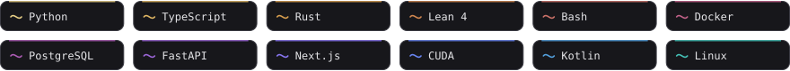
</picture>

<picture>
  <source media="(prefers-color-scheme: light)" srcset="assets/section-07-light.svg" />
  
</picture>

<i>All three cards below are generated by my own script, not a third-party render
service — <a href="scripts/update_readme.py">source</a>. The last one that wasn't broke
the week I rebuilt this page. Zero left now.</i>

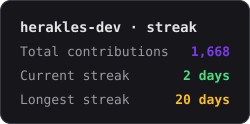

<picture>
  <source media="(prefers-color-scheme: light)" srcset="assets/section-08-light.svg" />
  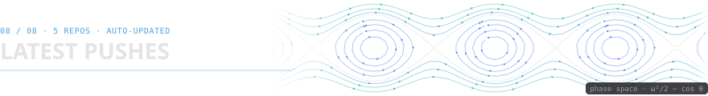
</picture>

<i>Auto-updated — my own repos, most recently pushed.</i>

<!--START_SECTION:building-->
- **[nightjar](https://github.com/herakles-dev/nightjar)** — Offline Android app demonstrating covert data transmission (hiding data in sound and images) and the detection techniques that can catch it. Acoustic data-over-sound modem, image/audio steganography, passive detector.
- **[typesafe-claude-kit](https://github.com/herakles-dev/typesafe-claude-kit)** `⭐ 1` — Claude Code kit for TypeSafe (Jev): agents, skill, client, calibration tools
- **[herakles-daimon](https://github.com/herakles-dev/herakles-daimon)** — AI-curated, mood-responsive media platform built with the Gemini Live API
- **[opensource-pipeline](https://github.com/herakles-dev/opensource-pipeline)** `⭐ 2` — Safely open-source any project with Claude Code. 3-agent pipeline that strips secrets, verifies sanitization, and generates professional docs. Just say /opensource fork my-project.
- **[v11](https://github.com/herakles-dev/v11)** `⭐ 1` — Spec-driven orchestration protocol for reliable multi-agent Claude Code development — task-as-truth, write-gate hooks, adversarial review pairing, autonomy tracking. Installable.
<!--END_SECTION:building-->

<picture>
  <source media="(prefers-color-scheme: light)" srcset="assets/divider-light.svg" />
  
</picture>

One more thing — Claude left a review.

<picture>
  <source media="(prefers-color-scheme: light)" srcset="assets/coda-light.svg" />
  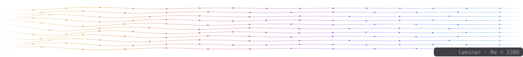
</picture>

Still up late most nights. Still shipping (just watch) If you've made it this far, FOLLOW ME!

**[herakles.dev](https://herakles.dev)** · **[keymakers.ai](https://keymakers.ai)** · [hello@herakles.dev](mailto:hello@herakles.dev)

