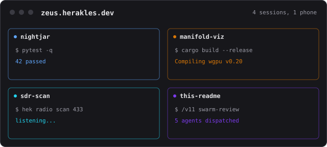
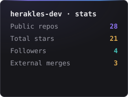
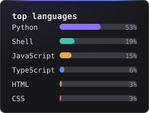

# Michael Piscitelli · `herakles-dev`

**Solo builder shipping production AI systems.** I run an agentic development practice at
[**herakles.dev**](https://herakles.dev) and I'm launching [**keymakers.ai**](https://keymakers.ai).

I'm Michael — Herakles. Fiber-optic network designer by day, and since mid-2025 a self-taught AI-agentic
engineer by night — building my own orchestration engine one 3am session at a time. The
engineering mindset stuck. The credential didn't.

The origin story is dumb and true: I automated my telecom crew's grunt work so well that we
out-earned the managers. So the company cut our per-foot rate and kept the difference. That's
the whole reason I do this now — I'd rather build the leverage and own it.

So I do. Everything here is self-hosted, runs in production, and the claims check out. I lead the
agents, review the diffs, and steer the system — more conductor than typist, though I still write
plenty of code by hand. I don't ship demos.

## 🟢 Live right now

- **[fine-print.org](https://fine-print.org)** — paste a Terms of Service, get back what you're
  actually agreeing to. Runs on my own multi-provider LLM gateway, not a single rented API.
- **[subfold.pro](https://subfold.pro)** — a music-reactive visual instrument: real-time 3D
  fractals that fold to the beat.

## 🔀 Merged into the wild

<i>Auto-updated weekly by a GitHub Action I own — external PRs that maintainers merged, newest first. No hand-editing.</i>

<!--START_SECTION:merges-->
- **[google-deepmind/formal-conjectures#5481](https://github.com/google-deepmind/formal-conjectures/pull/5481)** &nbsp;`⭐ 1.3k` — feat(ErdosProblems/672): link an external Lean proof of erdos_672.variants.euler · `2026-09-18`
- **[google-deepmind/formal-conjectures#5425](https://github.com/google-deepmind/formal-conjectures/pull/5425)** &nbsp;`⭐ 1.3k` — feat(ErdosProblems/399): prove erdos_399.variants.cambie · `2026-09-18`
- **[affaan-m/ECC#1036](https://github.com/affaan-m/ECC/pull/1036)** &nbsp;`⭐ 265k` — feat(agents,skills): add opensource-pipeline — 3-agent workflow for safe public releases · `2026-03-31`
<!--END_SECTION:merges-->

Two of those are original Lean 4 proofs closing Erdős problems in Google DeepMind's
`formal-conjectures` — one of them fills a real gap in Mathlib. The third put a Claude Code
workflow of mine into a 265k-star repository.

## 🛠️ What I'm building

Bare-metal infrastructure, RF hardware, telecom domain work, security research, formal math, a
production SaaS with a real customer. Not a one-trick stack.

- **hekaton** — a Hetzner control plane driving an NVIDIA GH200 (624GB unified memory) over a
  Rust/gRPC+TLS bridge I wrote myself: AES-256-GCM encrypted reporting, NUMA-pinned deploys, 3-4
  quantized LLMs debating over ZeroMQ on one shared GPU pool. 20K lines of Rust, 2,757 passing
  tests, GPU spend tracked against a budget I set myself. Got burned once by an untested vLLM
  upgrade in prod — every version bump now ships with a documented rollback plan.
- **herakles-linux-opus** — how I actually run this box: source of truth for 130+ services, 93
  containers, 71 nginx sites, 96 agents, running health checks, backups, and security scans on an
  11-job cron schedule, all exposed through 112 REST routes and a 22-tool MCP server so both I and
  my agents can query and act on it. It doesn't stop at monitoring — it also watches my own code:
  embeds and clusters all 144 of my repos to map what exists, finds duplicate code across my own
  sprawl, and ranks 290 of my own projects by how worth turning into a real product they are.
- **[v11](https://github.com/herakles-dev/v11)** — spec-driven orchestration protocol for
  multi-agent Claude Code work: task-as-truth state, write-gate hooks, adversarial review pairing.
- **SDR Command Center** — a Kotlin Android app bridging an RTL-SDR dongle over USB-C into a Pixel
  6a, tunneled home over WireGuard: live FFT waterfall, multi-mode demodulation, remote scans
  across four ISM bands.
- **Fiber Tree v2** — FTTH network design software: spatial pathfinding, loss-budget calculation,
  splitter placement, 30 PostgreSQL tables with PostGIS. Ten years of telecom design work, encoded.
- **CK Reynolds Tax** — a live tax-prep SaaS with a real customer: Stripe, 2FA, IRS Pub 4557
  compliance. Not a demo — daily-use production software.
- **Reticulum** — a sovereign, off-grid mesh network on my own protocol stack (RNS + LXMF): a
  live D3.js orbital visualization of the mesh, routing tables I inspect by hand, a Raspberry Pi
  node running 24/7, LoRa hardware next on the list. Nobody assigned this one.
- **[opensource-pipeline](https://github.com/herakles-dev/opensource-pipeline) & math-proof** —
  the two tools behind the merges above: a fork → sanitize → package pipeline, and a Lean 4
  theorem-proving swarm where the kernel is the only arbiter of truth (48 proofs machine-checked
  in 8 days, zero `sorry`s).
- **keymakers.ai** — what I'm launching, now split into an org: `keymakers-core` (key duplication
  by mail, computer vision doing the matching) and `keymakers-club` (membership platform for
  agentic engineers). Work in progress, built the same way as everything else here.

## 🖥️ Zeus Terminal — how all of this gets built

I'm talking to Claude through it right now. Zeus Terminal is a self-hosted, mobile-first web
terminal I built to replace Termux: tmux persistence, WebSocket transport, 804 tests, continue a
session from my phone to my laptop without losing state. It's a
session multiplexer — every project gets its own window, several Claude Code agents run in
parallel, and a `/handoff` command lets me spin up a fresh session mid-task without losing
context. My daily driver, not a side project.

<i>This README, the Actions that keep it updated, and everything else on this page were
built from inside it.</i>

## A few things that don't fit on a résumé

- Built a **Pac-Man ghost AI** that lives on my Android homescreen and chases my taps around —
  28KB APK, runs at 2-3% CPU, entirely pointless and I love it.
- My grocery price tracker **bypasses Cloudflare** to watch 900+ items at the store down the
  street, because I got tired of guessing what's actually on sale.
- A phone-to-phone **acoustic covert data channel**, with its own on-device detector, because I
  wondered if two phones could talk without a network.
- My login page has **custom GLSL liquid shaders** for no reason other than it looked cool at
  2am and I didn't undo it.

## Stack

<i>The two cards below are generated by my own script, not a third-party render
service — <a href="scripts/update_readme.py">source</a>. The last one that wasn't broke
the week I rebuilt this page.</i>

<picture>
  <source media="(prefers-color-scheme: dark)" srcset="https://raw.githubusercontent.com/herakles-dev/herakles-dev/output/github-snake-dark.svg" />
  <source media="(prefers-color-scheme: light)" srcset="https://raw.githubusercontent.com/herakles-dev/herakles-dev/output/github-snake.svg" />
  
</picture>

## 🌱 Latest pushes

<i>Auto-updated — my own repos, most recently pushed.</i>

<!--START_SECTION:building-->
- **[typesafe-claude-kit](https://github.com/herakles-dev/typesafe-claude-kit)** `⭐ 1` — Claude Code kit for TypeSafe (Jev): agents, skill, client, calibration tools
- **[herakles-daimon](https://github.com/herakles-dev/herakles-daimon)** — AI-curated, mood-responsive media platform built with the Gemini Live API
- **[opensource-pipeline](https://github.com/herakles-dev/opensource-pipeline)** `⭐ 2` — Safely open-source any project with Claude Code. 3-agent pipeline that strips secrets, verifies sanitization, and generates professional docs. Just say /opensource fork my-project.
- **[v11](https://github.com/herakles-dev/v11)** `⭐ 1` — Spec-driven orchestration protocol for reliable multi-agent Claude Code development — task-as-truth, write-gate hooks, adversarial review pairing, autonomy tracking. Installable.
- **[claude-code-agents](https://github.com/herakles-dev/claude-code-agents)** `⭐ 1` — Curated, transferable Claude Code subagents in installable packages — orchestration, engineering, security, devops — plus a CLAUDE.md template for multi-agent projects.
<!--END_SECTION:building-->

One more thing — Claude left a review.

Still up at 3am most nights. Still shipping.

**[herakles.dev](https://herakles.dev)** · **[keymakers.ai](https://keymakers.ai)** · [hello@herakles.dev](mailto:hello@herakles.dev)

